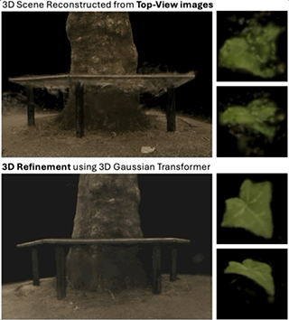

## 3D Gaussian Transformer

Abstract: 3D Gaussian Splatting enables fast and high-quality reconstruction of 3D scenes from sparse 2D images of the scene, by spawning and optimizing millions of 3D ellipsoids (modeled as a set of multivariate Gaussian functions) such that their projection into different camera planes match the recorded image from each camera view. However, when camera views are restricted, for example only top-views of a scene have been recorded, the reconstructed 3D scenes will exhibit significant artifacts due to occlusion. The top figure shows such artifacts when reconstructing a 3D tree-trunk and a 3D leaf from only top-view images. To address this problem, we developed a generative 3D Gaussian Transformer, which is trained on synthetic pairs of clean and distorted 3D scenes to learn to generate a sequence of clean 3D Gaussians conditioned on the set of Gaussians in the distorted 3D scene. The bottom figure shows the application of our solution to the tree and the leaf, where it successfully reduces artifacts and recovers the missing structures. This work will enable high quality 3D reconstruction in hard-to-reach and hazardous scenes, where imaging is feasible only from a few viewing directions.