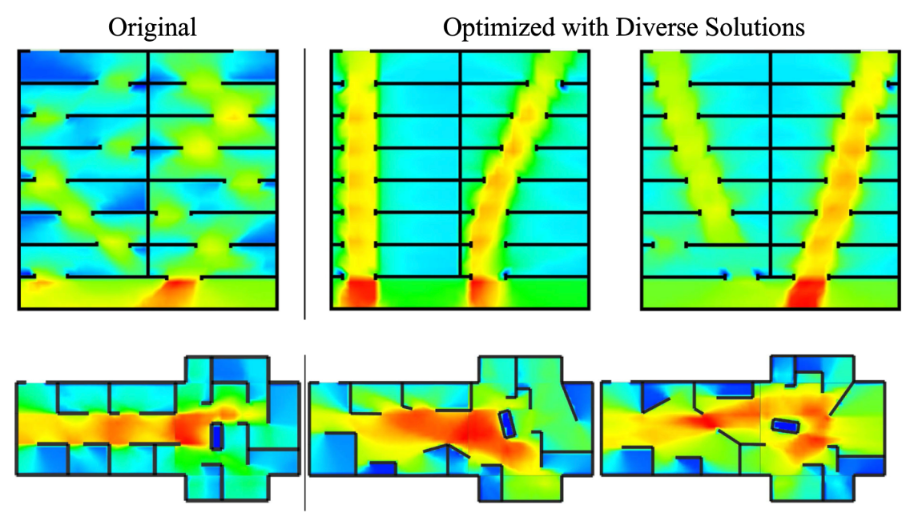

## Crowd-Aware Environment Design

Abstract: In this project we explore the use of computational models of crowd behavior to assist architects and engineers in designing safe and efficient environment in which people are able to move about comfortably under normal conditions and evacuate quickly in an emergency. We developed two production-grade systems, CODE and IDOME, which enabled AI-powered crowd-aware environment design, allowing engineers and architects to make informed decisions with respect to safety and comfort without the need for expensive, time consuming, and hazardous experiments involving actual human subjects. This is an example of the use of applied computational modeling in the service of safety and quality-of-life.

Publication: <i>Interactive architectural design with diverse solution exploration.</i> <a target="_blank" rel="noopener noreferrer" href="https://ieeexplore.ieee.org/abstract/document/8823048/">IEEE TVCG 2019</a> <a target="_blank" rel="noopener noreferrer" href="https://ieeexplore.ieee.org/ielaam/2945/9269519/8823048-aam.pdf">[Paper]</a> <a target="_blank" rel="noopener noreferrer" href="https://github.com/SteerSuite/Release">[Code]</a>

Publication: <i>CODE: Crowd‐optimized design of environments.</i> <a target="_blank" rel="noopener noreferrer" href="https://onlinelibrary.wiley.com/doi/abs/10.1002/cav.1749">Computer Animation and Virtual Worlds 2017</a> <a target="_blank" rel="noopener noreferrer" href="http://dspace.library.uvic.ca/bitstream/handle/1828/15136/Haworth_Comput._Animat._Virtual_Worlds_2017.pdf?sequence=1&isAllowed=y">[Paper]</a> <a target="_blank" rel="noopener noreferrer" href="https://github.com/SteerSuite/Release">[Code]</a>

Publication: <i>Using synthetic crowds to inform building pillar placements.</i> <a target="_blank" rel="noopener noreferrer" href="https://ieeexplore.ieee.org/abstract/document/7563566/">IEEE VHCIE 2016</a> <a target="_blank" rel="noopener noreferrer" href="http://dspace.library.uvic.ca/bitstream/handle/1828/15132/Haworth_IEEE_Virtual_Humans_and_Crowds_for_Immersive_Environments_VHCIE_2016.pdf?sequence=1&isAllowed=y">[Paper]</a> <a target="_blank" rel="noopener noreferrer" href="https://github.com/SteerSuite/Release">[Code]</a>