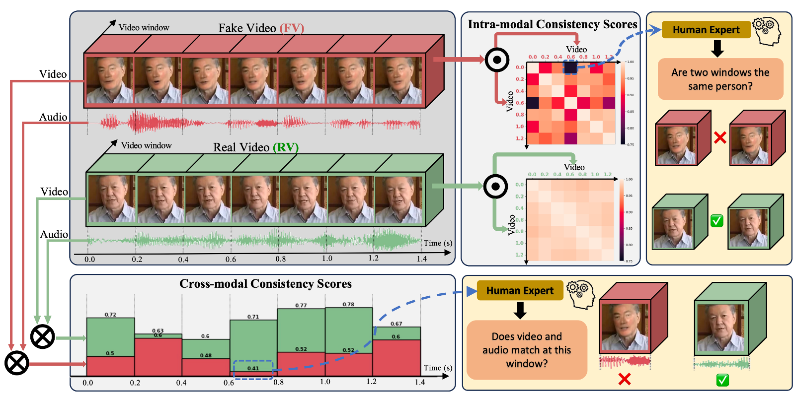

## Generalizable and Scalable Deepfake Detection

Abstract: In this project, we first empirically and theoretically prove that deepfake methods -- methods that transfer the motion of a source video to a target identity such that it appears to say the words uttered by the source -- will always leave an inevitable trace in the video, and then develop a system capable of detecting this particular trace. The proposed method utilizes intra- and cross-modal inconsistencies in facial videos to detect fakeness, and has three favorable properties: it is generalizable because it is trained only on real videos and therefore does not rely on a particular deepfake method; scalable because it does not require pristine samples for each identity of interest to compare against during inference and therefore can apply to arbitrarily many identities; and explainable because it can pinpoint the exact location of modality inconsistencies which are then verifiable by a human expert.

Publication: <i>Unsupervised multimodal deepfake detection using intra- and cross-modal inconsistencies.</i> <a target="_blank" rel="noopener noreferrer" href="https://arxiv.org/abs/2311.17088">Preprint</a> <a target="_blank" rel="noopener noreferrer" href="https://arxiv.org/pdf/2311.17088.pdf">[Paper]</a>