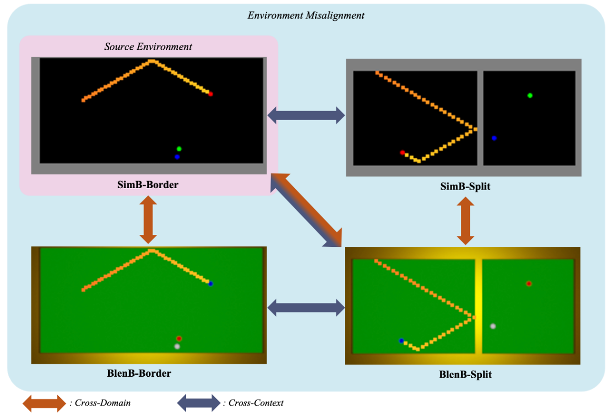

## Dynamics Prediction under Environment Misalignment

Abstract: Dynamics prediction, which is the problem of predicting future states of scene objects based on current and prior states, is drawing increasing attention as an instance of learning physics. Despite the success of deep learning methods in this task, their capability can be compromised under conditions of environment misalignment. In this project, we investigate such limitations in two particular instances of environment misalignment, cross-domain and cross-context, by proposing four datasets that are designed for these challenges.

Publication: <i>A critical view of vision-based long-term dynamics prediction under environment misalignment.</i> <a target="_blank" rel="noopener noreferrer" href="https://icml.cc/virtual/2023/poster/23866">ICML 2023</a> <a target="_blank" rel="noopener noreferrer" href="https://proceedings.mlr.press/v202/xie23e/xie23e.pdf">[Paper]</a> <a target="_blank" rel="noopener noreferrer" href="https://github.com/vimal-isi-edu/VDP-EMC">[Code]</a>