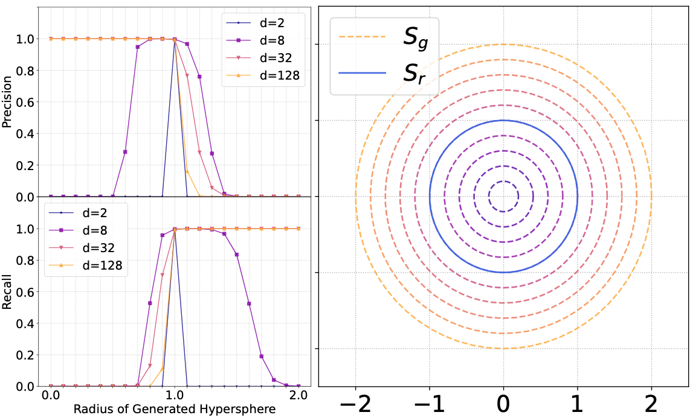

## Emergent Asymmetry of Precision and Recall for Measuring Generative Model's Performance

Abstract: Precision and Recall are two prominent metrics of generative performance, which were proposed to separately measure the fidelity and diversity of generative models. Given their central role in comparing and improving generative models, understanding their limitations are crucially important. In this project, we identify a critical flaw in the common approximation of these metrics using k-nearest-neighbors, namely, that the very interpretations of fidelity and diversity that are assigned to Precision and Recall can fail in high dimensions, resulting in very misleading conclusions.

Publication: <i>Emergent asymmetry of precision and recall for measuring fidelity and diversity of generative models in high dimensions.</i> <a target="_blank" rel="noopener noreferrer" href="https://icml.cc/virtual/2023/poster/23612">ICML 2023</a> <a target="_blank" rel="noopener noreferrer" href="https://arxiv.org/pdf/2306.09618.pdf">[Paper]</a> <a target="_blank" rel="noopener noreferrer" href="https://github.com/mahyarkoy/emergent_asymmetry_pr">[Code]</a>