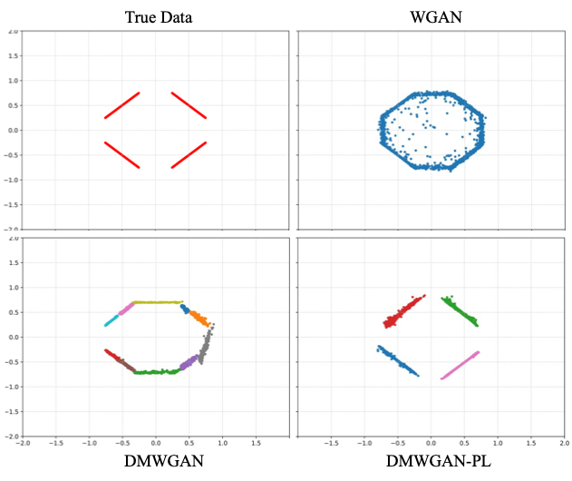

## Geometric Bias in Generative Adversarial Networks

Abstract: Real-world data distributions may lie on a union of disjoint manifolds rather than one globally connected manifold, and this can cause several difficulties for the training of Generative Adversarial Networks (GANs). In this project, we show that single generator GANs are unable to correctly model a distribution supported on a disconnected manifold, investigate its consequences in terms of their sample quality, diversity and convergence properties, and finally propose solutions to improve this geometric bias.

Publication: <i>Disconnected manifold learning for generative adversarial networks.</i> <a target="_blank" rel="noopener noreferrer" href="https://papers.nips.cc/paper_files/paper/2018/hash/2b346a0aa375a07f5a90a344a61416c4-Abstract.html">NeurIPS 2018</a> <a target="_blank" rel="noopener noreferrer" href="https://arxiv.org/pdf/1806.00880.pdf">[Paper]</a> <a target="_blank" rel="noopener noreferrer" href="https://github.com/mahyarkoy/dmgan_release">[Code]</a>