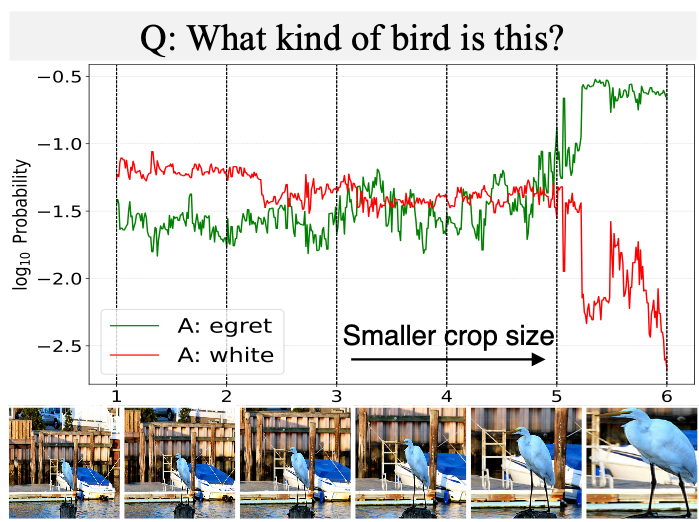

## Perceptual Bias in Multimodal Large Language Models

Abstract: Multimodal Large Language Models (LLMs) have recently achieved promising zero-shot accuracy on visual question answering (VQA) -- a fundamental task affecting various downstream applications and domains. Given the great potential for the broad use of these models, it is important to investigate their limitations in dealing with different image and question properties. In this project, we investigate whether multimodal LLMs can perceive small details as well as large details in images. In particular, we show that their accuracy in answering visual questions is very sensitive to the size of the visual subject of the question, reveal several visual factors that contribute to this sensitivity, and develop methods to mitigate it.

Publication: <i>Visual cropping improves zero-shot question answering of multimodal large language models.</i> <a target="_blank" rel="noopener noreferrer" href="https://sites.google.com/view/r0-fomo">NeurIPS 2023 R0-FoMo Workshop</a> <a target="_blank" rel="noopener noreferrer" href="https://openreview.net/attachment?id=YrYcoV2dAk&name=pdf#:~:text=Overall%2C%20our%20findings%20suggest%20that,gap%20with%20human%20visual%20cropping.">[Paper]</a> <a target="_blank" rel="noopener noreferrer" href="https://github.com/saccharomycetes/visual_crop_zsvqa">[Code]</a>

Publication: <i>Towards perceiving small visual details in zero-shot visual question answering with multimodal LLMs</i> <a target="_blank" rel="noopener noreferrer" href="https://arxiv.org/abs/2310.16033">Preprint</a> <a target="_blank" rel="noopener noreferrer" href="https://arxiv.org/pdf/2310.16033.pdf">[Paper]</a> <a target="_blank" rel="noopener noreferrer" href="https://github.com/saccharomycetes/visual_crop_zsvqa">[Code]</a>

Publication: <i>Exploring perceptual limitation of multimodal large language models</i> <a target="_blank" rel="noopener noreferrer" href="https://arxiv.org/abs/2402.07384">Preprint</a> <a target="_blank" rel="noopener noreferrer" href="https://arxiv.org/pdf/2402.07384.pdf">[Paper]</a> <a target="_blank" rel="noopener noreferrer" href="https://github.com/saccharomycetes/mllm-perceptual-limitation">[Code]</a>