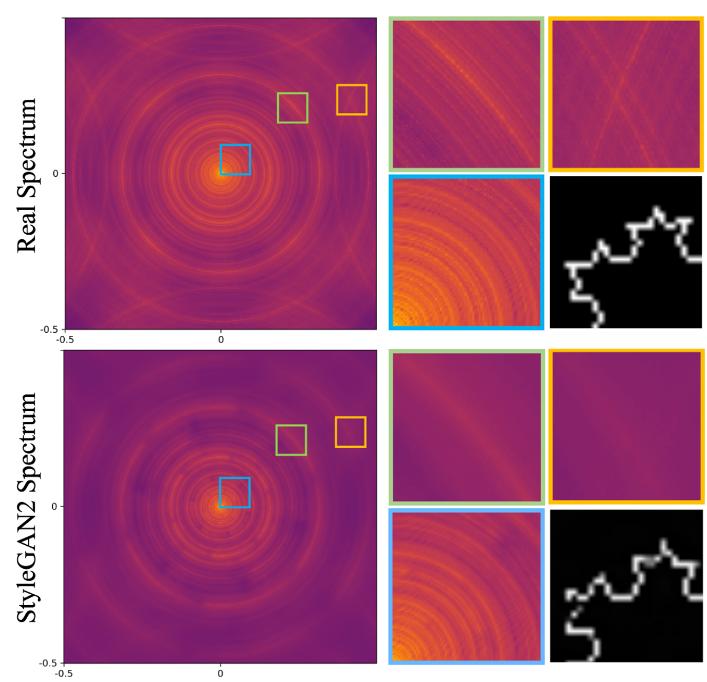

## Spectral Bias in Convolutional Generative Adversarial Networks

Abstract: Understanding the capability of Generative Adversarial Networks (GANs) in learning the full spectrum of spatial frequencies, that is, beyond the low-frequency dominant spectrum of natural images, is critical for assessing the reliability of GAN-generated data in any detail-sensitive application. In this project, we show that the ability of convolutional GANs to learn an image distribution depends on the spatial frequency of the underlying carrier signal, that is, they have a bias against learning high spatial frequencies.

Publication: <i>Spatial frequency bias in convolutional generative adversarial networks.</i> <a target="_blank" rel="noopener noreferrer" href="https://ojs.aaai.org/index.php/AAAI/article/view/20675">AAAI 2022</a> <a target="_blank" rel="noopener noreferrer" href="https://ojs.aaai.org/index.php/AAAI/article/view/20675">[Paper]</a>