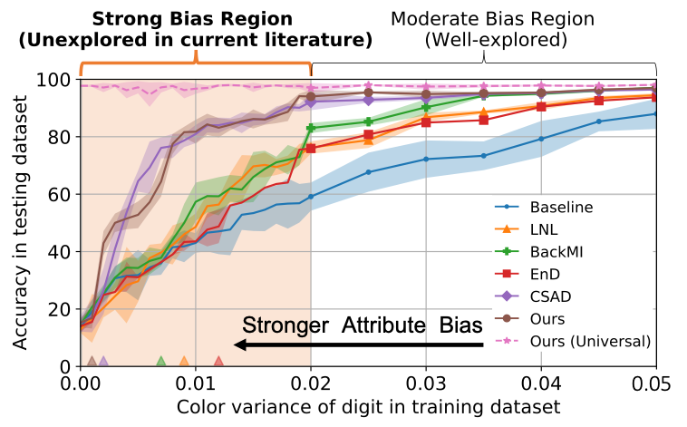

## Strong Attribute Bias Removal in Neural Networks

Abstract: Ensuring a neural network is not relying on protected attributes for prediction is crucial in advancing fair and trustworthy AI. While several promising methods for removing attribute bias in neural networks have been proposed, their limitations remain under-explored. In this project, we mathematically and empirically reveal the limitation of existing attribute bias removal methods in presence of strong bias and propose a new method that can mitigate this limitation.

Publication: <i>Information-theoretic bounds on the removal of attribute-specific bias from neural networks.</i> <a target="_blank" rel="noopener noreferrer" href="https://www.afciworkshop.org">NeurIPS 2023 Algorithmic Fairness Workshop</a> <a target="_blank" rel="noopener noreferrer" href="https://arxiv.org/pdf/2310.04955.pdf">[Paper]</a> <a target="_blank" rel="noopener noreferrer" href="https://github.com/jiazhi412/strong_attribute_bias">[Code]</a>

Publication: <i>SABAF: removing strong attribute bias from neural networks with adversarial filtering.</i> <a target="_blank" rel="noopener noreferrer" href="https://arxiv.org/abs/2311.07141">Preprint</a> <a target="_blank" rel="noopener noreferrer" href="https://arxiv.org/pdf/2311.07141.pdf">[Paper]</a> <a target="_blank" rel="noopener noreferrer" href="https://github.com/jiazhi412/strong_attribute_bias">[Code]</a>