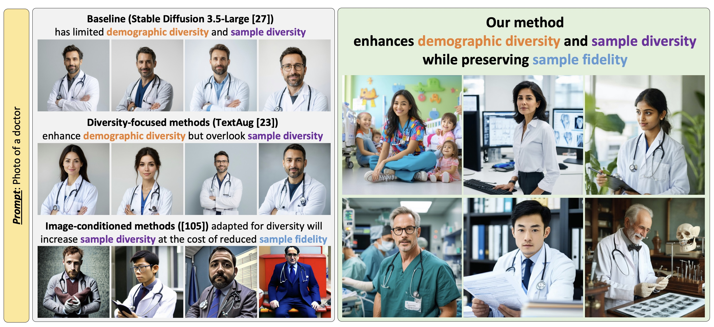

## Enhancing Diversity in Text-to-Image Generation without Compromising Fidelity

Abstract: Effective text-to-image generation must synthesize images that are both realistic in appearance (sample fidelity) and have sufficient variations (sample diversity). Diffusion models have achieved promising results in generating high-fidelity images based on textual prompts, but their diversity remains limited. How to generate images that have sufficient demographic and sample diversity, while preserving sample fidelity, remains an open problem. In this work, we propose a novel bimodal low-rank adaptation of pretrained diffusion models that decouples their image and text conditioning and enables sampling images with higher diversity while maintaining image fidelity.

Publication: <i>Enhancing diversity in text-to-image generation without compromising fidelity.</i> <a target="_blank" rel="noopener noreferrer" href="https://openreview.net/forum?id=180S4tOpmx">TMLR 2025</a> <a target="_blank" rel="noopener noreferrer" href="https://openreview.net/pdf?id=180S4tOpmx">[Paper]</a>